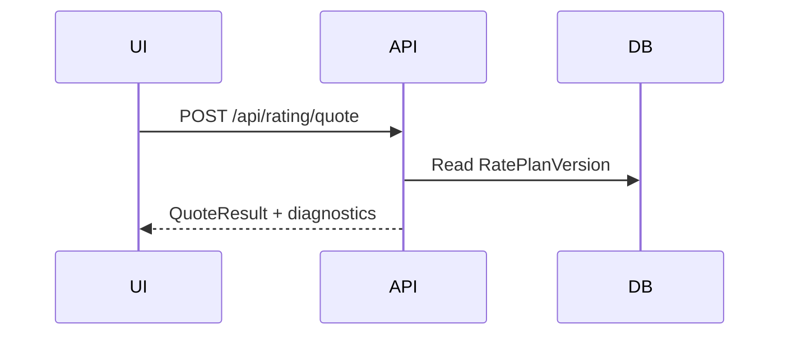

# Data flow

## DLOG ingest

Terminal/modem → transport adapter (future) → ingest API → `DlogTransactions.RawPayload` + classifier JSON + diagnostics.

## Table download

Operator publishes set → assignment → download batch items queued → **terminal ACK path not fully implemented** — see `HARDWARE_VALIDATION_REQUIRED` in implementation notes.

## Rating

Quote/authorize uses published rate plan snapshot + host MVP rules — firmware table-rated parity **not asserted**.

