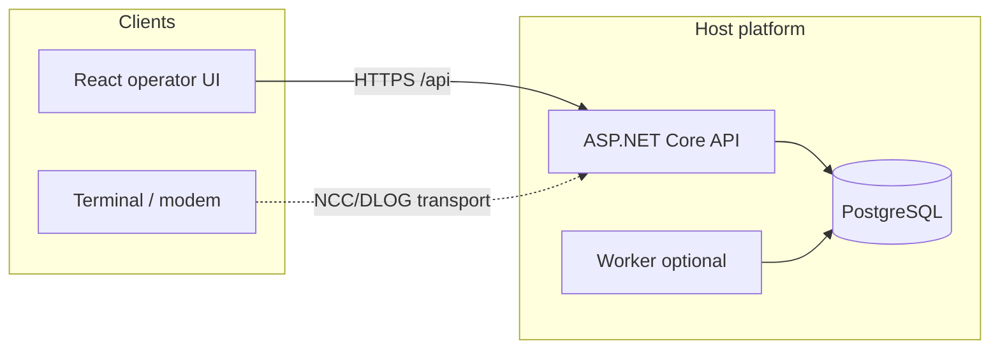

# Architecture at a glance

## Layers

- **HostPlatform.Api** — HTTP, auth middleware, controllers.
- **Domain** — entities and enums.
- **Infrastructure** — EF Core, DLOG engine, table distribution.
- **Protocols.\*** — NCC, DLOG pure parsing/classification.
- **Rating / Cards / Firmware** — domain services & policies.

See [Architecture → Service boundaries](../architecture/service-boundaries.md).
